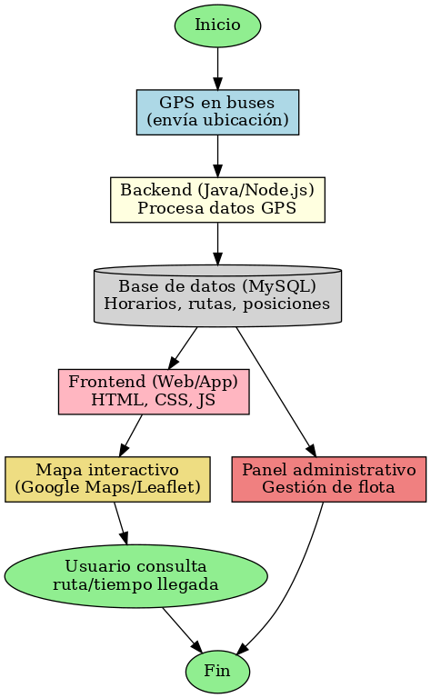
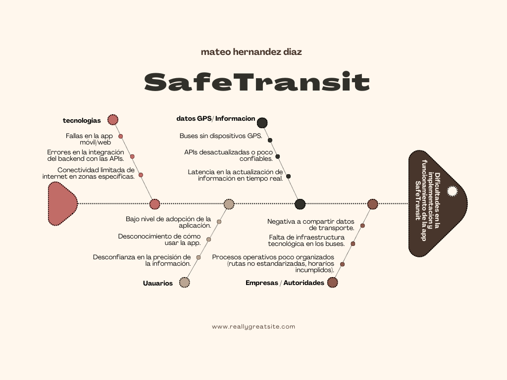

# 📌 Propuesta Proyecto de Grado – App de Alertas de Transporte Público

## 👤 Autor
- **Nombre:** Mateo hernandez diaz   
- **Carrera:** Tecnología en Desarrollo de Software  
- **Universidad:** Universidad Católica Luis Amigó  

---

## 🏷️ Nombre del proyecto
**SafeTransit – Alertas de Transporte Público en Tiempo Real**

---

## 🧩 Descripción del Problema
En muchas ciudades, los usuarios del transporte público no saben **cuándo pasará el bus**, si **ya pasó**, o si **viene lleno**.  
Esto genera **pérdida de tiempo**, **incertidumbre** y malas decisiones de ruta.

---

## 💡 Solución Propuesta
Desarrollar una **aplicación web/móvil** que muestre información confiable del transporte **sin depender de reportes del usuario**:

- 🚍 **Posición de buses en tiempo real** usando datos de GPS de empresas/autoridades (cuando exista API o datos abiertos).  
- ⏱️ **Tiempo estimado de llegada (ETA)** a cada parada mediante cálculo de distancia y velocidad histórica.  
- ⭐ **Reportes opcionales de ocupación** (vacío/medio/lleno). La app funciona igual sin ellos.  
- 🔔 **Alertas** si un bus presenta retrasos inusuales o desvíos.  
- 📍 **Paradas favoritas** y notificaciones cuando el bus esté cerca.  

> Primera versión: **mapa + ETA**; reportes ciudadanos como plus.  

---

## 🛠️ Tecnologías a Utilizar
- **Frontend móvil/web:** Flutter o React Native / React  
- **Mapas:** Google Maps Platform o Mapbox  
- **Backend:** Node.js (Express) o Python (FastAPI/Django)  
- **Base de datos:** PostgreSQL (PostGIS) o Firebase  
- **Tiempo real:** WebSockets (Socket.IO) o Firebase Realtime DB  
- **Control de Versiones:** Git & GitHub   

---

## 🔒 Privacidad y Fuentes de Datos
- Priorizar **datos oficiales** (APIs de empresas o datos abiertos).  
- Reportes ciudadanos **opcionales** y anónimos.  
- Cumplir Términos de Uso de mapas/APIs.

---

## Diagrama de Flujo

## Diagrama de ishikawa

